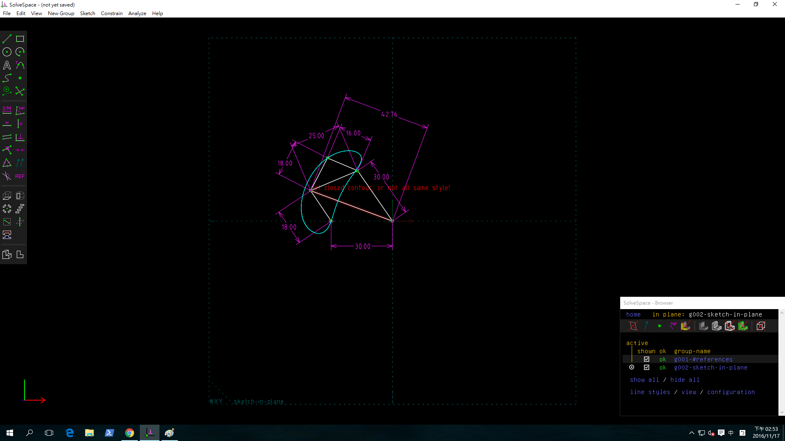
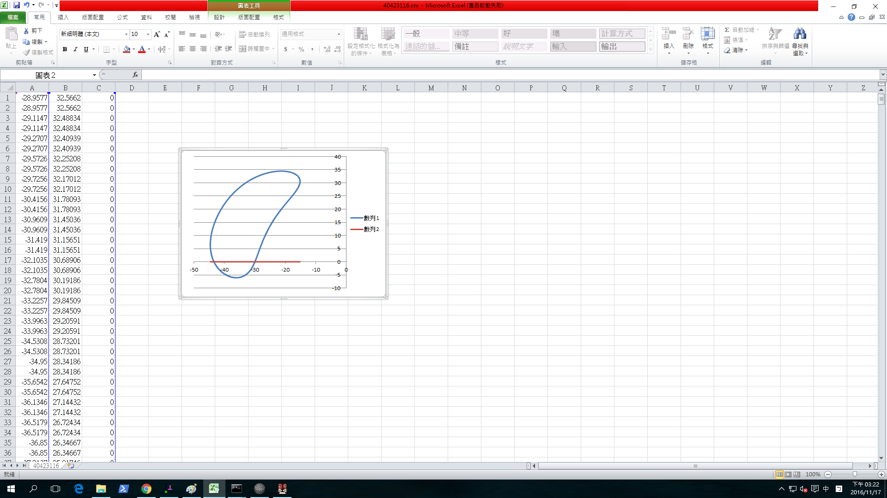

Title: 四連桿機構V2.
Date: 2016-11-17 12:00
Category: 作業
Tags: WiKi
Author: 40423116

W10-4 四連桿機構V2.

<!-- PELICAN_END_SUMMARY -->

Solvespace 四連桿圖檔:

<a href="./../w10/40423116.csv">40423116.csv</a>

<a href="./../w10/40423116-w10-4.slvs">40423116-w10-4.slvs</a>

<!-- 導入 Brython 標準程式庫 -->

<!-- 啟動 Brython -->

<!-- 以下實際利用  Brython 畫兩條直線 -->

<canvas id="W10" width="600" height="200"></canvas>

###聖誕禮物###
<!-- 導入 brython.js -->

<!-- 啟動 brython() -->

<!-- 以下利用 Brython 程式執行繪圖 -->

<canvas id="plotarea" width="500" height="500"></canvas>

